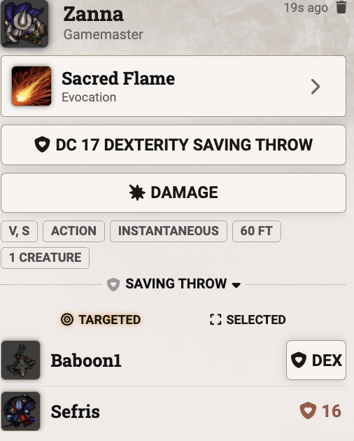

# Save Tray 5e

**Save Tray 5e** adds a compact saving throw tray to D&D5e save chat messages, listing targeted creatures and their results. Players can roll their own saves from the tray (permission-based), and the tray updates automatically as rolls are made.

