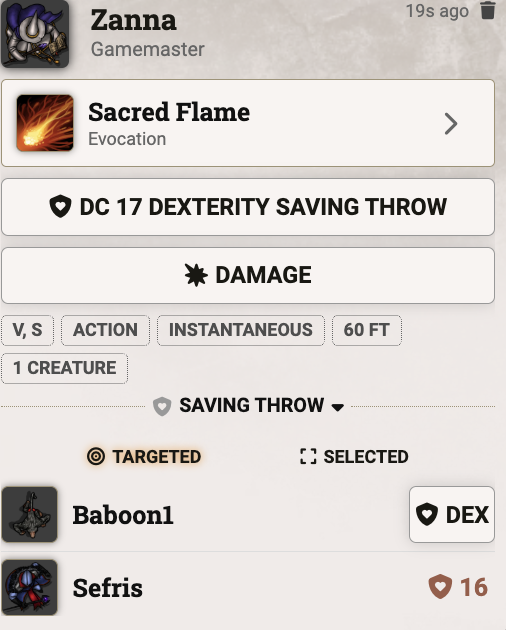

# Save Tray 5e

**Save Tray 5e** is a lightweight module that enhances D&D 5e saving throw chat messages by adding a compact **Save Tray**, similar to the system’s damage tray for applying damage. It displays **targeted** creatures for all users and **selected** creatures for GMs, along with their save results in a clear, system-like layout.

Targeted creatures are locked in when the chat message is created, while selected creatures update dynamically based on the GM's current selection. Save results are stored internally, allowing previously rolled saves to be restored when a creature is reselected. Players can roll their own saves directly from targeted tray entries they own, and the tray updates automatically as rolls come in.

The module also supports **multiple saves**, with a separate button for each save.

Optionally, the module can use the current targeted creatures, or the GM's current selection, when applying damage and automatically determine the correct damage multiplier based on the recorded save result (full, half, or no damage).

This module is intended as a possible workaround for the related D&D 5e system issue https://github.com/foundryvtt/dnd5e/issues/3897

